## Abstract

This report describes the design and implementation of `rustld`, a user-space ELF loader written in Rust that executes Linux binaries by reconstructing the runtime contract normally assembled by the kernel and system dynamic linker. The implementation is intended for real binaries rather than reduced demonstrations. It includes executable and shared-object mapping, startup stack and auxv reconstruction, recursive dependency loading, architecture-specific relocation engines, static and runtime TLS management, constructor sequencing, and final control transfer to the target entrypoint.

**Repository:** [louislafosse/rustld](https://github.com/louislafosse/rustld)

The system supports `x86_64` and `aarch64`, and handles both glibc- and musl-oriented targets through explicit startup policy branching. It is available both as a direct executable interface and as an embeddable runtime via Rust and C APIs. This document presents the full technical story from architecture decisions to subsystem mechanics, with emphasis on ordering constraints, failure modes encountered during implementation, and the reasoning that shaped the current codebase.

## 1. Introduction

Dynamic loading is often taught as a straightforward sequence: parse ELF headers, map segments, relocate symbols, jump to entry. In production, this sequence is only the outer shell. Actual loader behavior is a coupled protocol among memory mapping, process startup metadata, relocation state, TLS metadata, constructor ordering, and libc-facing runtime-linker surfaces. Local correctness in one subsystem is not enough if another subsystem is only partially initialized when user code or constructors begin to execute.
`rustld` was built under this practical constraint. The project was not intended to be a byte-identical clone of `ld-linux`, but a controllable user-space runtime that can execute realistic binaries and keep enough compatibility for common glibc and musl workflows. The implementation therefore optimized for explicitness of order, data-structure ownership, and architecture isolation.

Very minimal representation of a Dynamic Linker :


## 2. Problem Framing and Scope

The central technical problem is to launch a target image with startup semantics that are valid for code that was not compiled with `rustld` in mind. This means the loader must satisfy assumptions made by startup objects, libc internals, constructors, symbol resolvers, and thread-local access paths. Those assumptions are sometimes undocumented or distribution-dependent.

The scope of `rustld` includes loading from raw bytes and from paths, static and dynamic execution paths, dependency graph loading through `DT_NEEDED`, relocation for both supported architectures, TLS setup and runtime growth, and dlfcn-facing behavior through runtime stubs. The scope also includes integration interfaces that are usable in embedding scenarios without requiring direct modification of loader internals.

The scope does not claim perfect host-loader parity for every glibc-internal path. It also does not claim that every instrumentation environment preserves native behavior, especially in areas such as rseq or emulated memory-model behavior.

## 3. Architectural Decomposition

The repository separates high-level policy from low-level mechanism. Shared policy modules own process-level sequencing, graph orchestration, and compatibility state transitions. Architecture-specific modules own syscall ABI, relocation opcode logic, thread-pointer operations, and entry trampolines.

In practical terms, `src/runtime_loader.rs` and `src/start/mod.rs` define the execution envelope. `src/linking/mod.rs` and `src/shared_object.rs` define object graph and symbol resolution behavior. `src/tls.rs` defines TLS layout, installation, and runtime extension behavior. `src/ld_stubs.rs` provides runtime-linker-compatible exports and helper routines. `src/c_api.rs` provides C ABI integration.

Architecture-specific implementations are isolated in `src/arch/x86_64/*` and `src/arch/aarch64/*`. This split keeps portability work manageable: architecture fixes stay local, while shared startup policy remains stable.

## 4. API Surface and Entry Semantics

The primary public type is `ElfLoader`. The loader accepts an argv vector for target execution and optional environment and auxv overrides. By default, if overrides are absent, parent process state is reused.

```rust
pub unsafe fn prepare_from_bytes(
    &self,
    elf_bytes: &[u8],
    target_argv: Vec<String>,
    env_pointer: Option<*const *const u8>,
    auxv_template: Option<&[AuxiliaryVectorItem]>,
    verbose: bool,
) -> JumpInfo
```

The API deliberately splits preparation from execution. `prepare_*` returns `JumpInfo` so callers can inspect or delay transfer. `execute_*` performs preparation and immediately transfers control. Additional entry-override variants accept either a symbol name or explicit address, enabling use cases that target non-default entrypoints such as shared-library function dispatch.

A configurable `indirect_syscalls` mode is available where architecture support exists. This setting is applied before loading work starts, so syscall behavior is consistent through the full startup pipeline.

## 5. High-Level Startup Pipeline

The startup pipeline in `launch_target_with_source` transforms input bytes and caller metadata into a runnable process context. The loader first resolves the target source and builds a loaded image abstraction. It then normalizes and patches auxv to match target image properties and reconstructs a target-style startup stack. From there, the control path diverges between static and dynamic handling.

For static targets, the pipeline can return directly once the stack and entrypoint are finalized. For dynamic targets, the loader proceeds through object-graph loading, scope construction, relocation convergence, TLS installation, compatibility-state publication, constructor execution, and entry transfer.

This split keeps static handling simple while preserving full dynamic semantics when needed.

## 6. ELF Mapping and BSS Materialization

Segment mapping follows PT_LOAD semantics with explicit byte-copy and zero-fill behavior. Accurate bounds and alignment are essential because downstream relocation and TLS logic assume mapped ranges are complete and consistent.

```rust
if header.p_filesz > 0 {
    core::ptr::copy_nonoverlapping(
        elf_bytes.as_ptr().add(header.p_offset),
        dest,
        header.p_filesz,
    );
}
if header.p_memsz > header.p_filesz {
    core::ptr::write_bytes(
        dest.add(header.p_filesz),
        0,
        header.p_memsz - header.p_filesz,
    );
}
```

A recurring implementation lesson was that mapping errors often manifest as late-stage failures. Relocation, constructors, or thread setup may appear to fail, while the true root cause is an earlier segment-boundary or base-address mismatch.

## 7. Startup Stack and Auxv Reconstruction

After mapping, the loader rewrites auxv fields to describe the target image and runtime capabilities. It updates fields such as `AT_PHDR`, `AT_PHNUM`, `AT_PHENT`, `AT_ENTRY`, `AT_EXECFN`, and capability/page-size tags. It also stabilizes pointer-backed auxv entries and random-related values so consumers see durable addresses.

The stack image is rebuilt instead of partially mutating host-provided stack memory. This reconstruction includes `argc`, null-terminated argv and envp vectors, and auxv key/value records ending in `AT_NULL`. Rebuilding the stack as a coherent object significantly reduced early instability tied to pointer lifetime and layout mismatches.

## 8. Interpreter Policy and musl In-Process Bootstrap

The current implementation does not hand execution to an external interpreter process for musl targets. `PT_INTERP` is still parsed and used as metadata and for object loading decisions, but rustld keeps control and runs the full mapping, relocation, TLS, and constructor pipeline in-process for both glibc and musl binaries. In other words, interpreter metadata influences load decisions, not process control flow.

The musl path diverges from glibc in one key place: rustld does not initialize glibc rtld global stubs for musl targets. Instead, after graph loading and relocation, rustld installs musl TLS semantics (`install_tls_musl`) and then reconstructs the minimum musl stage-2 runtime state that startup code expects to observe. This is done by symbol-driven decoding around `__dls2b`, not by fixed absolute offsets only.

The stage-2b reconstruction has architecture-specific decoding logic. On `x86_64`, rustld decodes RIP-relative instruction forms (`mov/lea/call` patterns) to recover the locations of auxv slot pointers, TLS size/align words, hwcap slot, and self pointer slot. On `aarch64`, rustld decodes `ADRP+ADD`, `LDR/STR`, and `STP` sequences to recover the same class of state with PC-relative addressing. The decoded addresses are then written with controlled volatile stores during `seed_musl_stage2b_runtime_state`.

This decode-first model is critical because musl internals are sensitive to build layout and code generation details. Hardcoding offsets works for a narrow binary set and fails as soon as package rebuilds or architecture/toolchain variants shift local layout. By deriving slots from live code references at runtime, rustld preserves portability across real distributions.

In the current tree, stage-2b seeding also calls decoded stage helper functions when available and keeps an explicit internal queue-slot fallback (`seed_musl_internal_queue_slot`) for builds that still require it. This fallback is intentionally narrow and guarded; it exists to keep runtime behavior stable while preserving the decode/symbol-driven path as the primary mechanism.

The practical outcome is direct control transfer from rustld to the mapped target entrypoint, without a process-level interpreter handoff step and without relying on musl’s own loader process to perform startup state initialization.

```rust
if musl_target {
    crate::tls::install_tls_musl(&linker.objects, pseudorandom_bytes);
    seed_musl_stage2b_runtime_state(
        &linker,
        new_auxv as *const AuxiliaryVectorItem,
        image.interpreter_path.as_deref(),
        core::ptr::null(),
    );
}
```

This part of the pipeline is where most musl-specific regressions historically surfaced. The stabilizing constraints were: perform COPY before final IFUNC/IRELATIVE writes, seed stage-2 runtime state before dependency constructors run, and ensure TLS descriptor resolution observes finalized module IDs and TP-relative data.

## 9. Dynamic Object Graph Construction

Dynamic execution uses `DynamicLinker` to own the live object graph. The main executable is inserted first, dependencies are loaded recursively from `DT_NEEDED`, and aliases are recorded to normalize path-variant lookup behavior. Object metadata is encapsulated in `SharedObject`, including relocation slices, symbol/string tables, TLS descriptors, hash metadata, and dynamic-array pointers.

The graph also includes runtime link-map allocations and active-linker publication logic for stub and dlfcn interaction.

## 10. Lookup Scope Computation

Once objects are loaded, lookup scopes are rebuilt for each requester. This precomputed ordering makes relocation lookup deterministic and avoids repeated dependency traversal on every symbol query. The scope model combines executable-first preemption expectations with requester-specific traversal and load-order fallback behavior.

The scope precomputation pass is a performance optimization and a correctness mechanism. Without it, symbol resolution can drift under repeated graph traversal, especially when runtime loading introduces additional nodes.

## 11. Symbol Resolution Model

`SharedObject` symbol lookup supports GNU hash and SysV hash paths, symbol visibility checks, weak/global binding logic, and version filtering through `DT_VERSYM`. The object caches exportability in compact masks and precomputed buckets, allowing hot lookup paths to skip repeated structural checks.

Name matching is byte-oriented and supports version-suffixed comparisons with base-name fallback where appropriate. This reduces allocation and string-conversion overhead in relocation-heavy workloads.

At linker level, active-symbol lookup can route through the currently published linker instance, enabling runtime stub paths to resolve symbols without duplicating graph logic.

## 12. Relocation Framework

Relocation is implemented per architecture while preserving a shared orchestration pattern. For each object, the engine computes writable relocation ranges, applies RELA and RELR streams, defers resolver-sensitive classes, and later executes deferred passes in constrained order.

The x86_64 and aarch64 implementations differ in relocation opcode handling, TLS relocation forms, and some compatibility decisions, but both use the same structural rules for writable-range preparation and deferred execution.

## 13. Lookup Cache in Relocation Hot Paths

Relocation uses a dedicated cache keyed by requester and symbol identity to avoid repeated scope traversal and redundant resolution work. The cache separates no-exclusion and exclusion-aware lookups, reflecting common versus less common search patterns.

```rust
pub struct SymbolLookupCache {
    entries: FxHashMap<SymbolLookupKey, Option<(usize, Symbol)>>,
    entries_no_exclude: FxHashMap<NoExcludeLookupKey, Option<(usize, Symbol)>>,
}
```

This cache was introduced after profiling showed repeated symbol resolution dominating relocation time in short-lived dynamic workloads.

## 14. Deferred IFUNC/IRELATIVE/COPY Semantics

Immediate relocation is not always safe. `rustld` queues IFUNC/IRELATIVE operations and copy relocations, then applies them after the primary relocation pass. The resulting order minimizes resolver execution against partially initialized global state.

```rust
relocation::apply_copy_relocations(&copies);
relocation::apply_irelative_relocations(&ifuncs);
```

This ordering was one of the highest-impact correctness changes in dynamic startup stability.

## 15. Stub-First Binding for Runtime-Linker Symbols

Some symbols must bind to loader-provided behavior before external search paths are considered. This applies to runtime-linker and dlfcn-related names such as `_dl_*`, `_tunable_*`, and `__tls_get_addr`. Both architecture relocation engines include this policy so startup and runtime symbol requests are directed to the active loader’s compatibility layer when needed.

This decision avoids accidental binding to incompatible external implementations during phases where loader-owned metadata is authoritative.

## 16. TLS Layout as First-Class State

TLS handling begins with `prepare_tls_layout`. The loader assigns module IDs, computes aligned block offsets, reserves runtime static TLS space, and computes TP-relative offsets. It also reserves a small rseq-safe region below TP, based on observed glibc expectations in target environments.

The computed `TlsLayout` is then consumed by `install_tls` and runtime extension paths. By making layout explicit and persistent, the implementation avoids ad hoc TLS calculations at relocation time.

## 17. Initial TLS Installation

`install_tls` allocates TLS backing memory, copies module initialization images, zero-fills residual bytes, constructs TCB, allocates DTV with header slot, and initializes module pointers. Guard values are seeded from random input when available.

```rust
let module_slots = layout.module_count + 1;
let dtv_len = (module_slots + DTV_SURPLUS_SLOTS).max(module_slots);
let dtv_alloc_entries = dtv_len + 1;
```

Thread-pointer publication is architecture-specific. On x86_64, additional glibc-sensitive fields are initialized to avoid failures in fast paths that assume pre-populated pthread metadata.

## 18. Runtime TLS Module Registration

`register_runtime_tls_modules` extends TLS state after startup when new objects are loaded. It computes new module IDs, attempts static reserved placement, falls back to dynamic block allocation when static space is exhausted, and rebuilds DTV state as needed.

The function also propagates updates to tracked thread TCBs. This propagation is crucial, because existing threads may perform direct TP-relative accesses that become invalid if runtime TLS state is not synchronized process-wide.

## 19. TLSDESC and `__tls_get_addr` Integration

TLS relocations such as `DTPMOD`, `DTPOFF`, `TPOFF`, and `TLSDESC` require coordination between relocation engines and TLS runtime state. The loader resolves module IDs and offsets from linker object metadata and writes architecture-specific descriptor structures for runtime resolution.

`__tls_get_addr` support in `ld_stubs` and architecture helper addresses (`tlsdesc_return_addr`, resolver trampolines) complete the runtime path so dynamically loaded TLS modules are addressable from generated code.

## 20. Runtime-Linker Compatibility Region

`DynamicLinker::init_rtld_stubs` builds a synthetic compatibility region for glibc-facing startup and dlfcn behavior. It allocates backing storage for `_rtld_global`, `_rtld_global_ro`, link-map structures, and standalone globals. It also snapshots auxv and initializes guard-related fields.

```rust
struct RtldStubs {
    rtld_global: *mut u8,
    rtld_global_ro: *mut u8,
    link_map: *mut u8,
    libc_enable_secure: *mut u32,
    libc_stack_end: *mut *const u8,
    dl_argv: *mut *const *const u8,
    rseq_offset: *mut isize,
    rseq_size: *mut u32,
    rseq_flags: *mut u32,
    pointer_chk_guard: *mut usize,
    pointer_chk_guard_local: *mut usize,
    stack_chk_guard: *mut usize,
    auxv: *const AuxiliaryVectorItem,
}
```

The allocated layout is intentionally generous and zero-initialized because glibc may access fields beyond the minimal subset expected by simplified models.

### 20.1 Ubuntu-Only `x86_64` Crash Investigation (`sqrt_with_ld`)

One of the most instructive failures in this project was a distribution-sensitive
glibc startup bug that appeared on Ubuntu/Debian multiarch layouts but not on
`/lib64`-style environments.

The symptom was initially intermittent `SIGSEGV`/`SIGFPE` in the `x86_sqrt`
test path (`./tests/sqrt_with_ld`) while other binaries such as `ls`, `id`, and
`pwd` could succeed in the same run. The failing traces consistently ended near
glibc early startup and IFUNC-heavy relocation logs, then crashed before stable
user-space behavior was established.

The core issue was startup ordering under layout mismatch:

- forcing `__libc_early_init` on unsupported `x86_64` libc layouts could crash
  early because our synthetic rtld compatibility state is tuned for known glibc
  internal layouts;
- skipping `__libc_early_init` entirely avoided that crash, but left ctype
  internals uninitialized in paths reached by `sqrt_with_ld` (through glibc
  format/parse internals), causing null/invalid state dereferences later.

The fix was to make glibc startup policy explicit and layout-aware in
`src/start/mod.rs`:

```rust
if !x86_64_glibc_layout_supported(linker) {
    call_libc_ctype_init_fallback(linker);
    return;
}
```

So on supported layouts rustld still calls `__libc_early_init`; on unsupported
multiarch layouts (for example `/lib/x86_64-linux-gnu/libc.so.6`), rustld
skips full early-init and invokes `__ctype_init` as a targeted fallback.

In parallel, the glibc copy-threshold patching logic was tightened:

- prefer symbol-table derived offsets (`load_libc_copy_threshold_offsets_from_symtab`);
- only allow fixed-offset fallback on known `/lib64`-style libc paths.

That combination prevented both classes of failures: hard crashes when
`__libc_early_init` was forced on incompatible layouts, and later crashes from
missing ctype initialization when early-init was skipped.

## 21. Valgrind-Aware rseq Metadata

Instrumentation can invalidate assumptions that hold in native startup. `rustld` therefore carries valgrind-aware behavior for rseq metadata. When running under valgrind, rseq fields are disabled in stubs to avoid unsupported registration behavior. Under native x86_64 execution, rseq defaults follow expected TP-relative conventions.

This policy reduced false-negative startup failures under instrumentation while preserving native behavior.

## 22. Constructor Ordering and Initialization Graph

Constructors are invoked in dependency-aware order rather than insertion order. The loader computes an initialization sequence and executes `DT_INIT`/`DT_INIT_ARRAY` callbacks once relocation and TLS state are settled. Runtime loads through `dlopen_runtime` reuse the same principle, rooted at the requested subtree.

This sequencing avoids initialization code observing partially relocated or partially registered TLS state.

## 23. Runtime `dlopen` Extension Path

`dlopen_runtime` executes a scoped extension pipeline for newly loaded objects. It resolves and loads new dependencies, rebuilds scopes, registers runtime TLS modules for the new object slice, relocates new objects, applies deferred relocation queues, finalizes TLS images, and runs constructors in dependency order.

The separation from initial startup is intentional: runtime graph extension occurs with active threads and existing global state, so extension semantics differ from initial process bootstrap semantics.

## 24. C ABI Integration

The C interface in `src/c_api.rs` wraps loader behavior behind explicit status codes and pointer-based inputs. It supports preparation and direct execution variants, plus entry overrides.

```rust
#[unsafe(no_mangle)]
pub unsafe extern "C" fn rustld_elfloader_execute_from_bytes_with_entry(
    elf_bytes: *const u8,
    elf_len: usize,
    argc: usize,
    argv: *const *const c_char,
    entry_symbol: *const c_char,
    entry_address: usize,
    entry_address_is_set: i32,
    envp: *const *const c_char,
    auxv: *const RustLdAuxvItem,
    auxv_len: usize,
    verbose: i32,
    indirect_syscalls: i32,
) -> i32
```

The wrapper parses argv and auxv into Rust-owned representations, preserves override semantics, and catches panics so unwind does not cross FFI boundaries.

## 25. Cross-Architecture Implementation Notes

The architecture split allowed each backend to mature independently. x86_64 includes extensive relocation handling and startup compatibility tuning. aarch64 implements dedicated relocation and startup behavior under the same orchestration model and supports dynamic execution workflows validated through qemu user-mode testing.

Because shared orchestration is architecture-neutral, improvements in stack building, scope ordering, and runtime loading propagate across targets, while architecture-local ABI and relocation changes remain isolated.

## 26. Performance Engineering Process

Optimization work followed a strict measure-change-validate loop. Profiling first identified hot frames, usually in symbol lookup and relocation loops. Candidate changes were then applied in narrow scope and validated for both correctness and performance.

Examples of accepted improvements include keyed lookup caches, precomputed exportability masks, prebuilt requester scopes, and byte-level symbol-name operations. These changes were chosen because they reduced startup cost without widening correctness risk.

## 27. Regression Methodology

The regression suite intentionally mixes simple and complex workloads. Utility binaries such as `ls`, `pwd`, and `id` catch startup regressions quickly. Heavier binaries with broader dependency surfaces stress relocation and constructor ordering. Interactive workloads expose runtime behavior not visible in one-shot executions. Cross-architecture runs under qemu validate backend-specific behavior and rootfs sensitivity.

Each critical loader change was followed by rerunning this suite. This practice prevented local fixes from silently regressing unrelated subsystems.

## 28. Known Limits and Open Issues

Interactive `/usr/bin/fish` remains an explicit known limitation in certain PTY contexts, despite successful non-interactive behavior in equivalent environments. This indicates remaining runtime compatibility work in paths that are not exercised by simpler binaries.

Valgrind can emit `brk segment overflow` warnings with otherwise clean heap summaries. These warnings are tracked as tooling-model artifacts unless accompanied by independent evidence of corruption or leak.

Compatibility parity with all glibc internal paths remains a moving target, especially under unusual constructor and runtime loader interaction patterns.

## 29. Future Work

Future work includes deeper interactive-shell compatibility, continued aarch64 hardening on complex dynamic workloads, and further startup-performance improvements in relocation-heavy paths. Another active direction is narrowing unsafe scope further without sacrificing readability or throughput.

## 30. Conclusion

`rustld` has evolved from a bootstrap experiment into a practical user-space loader runtime. It reconstructs startup state, loads and relocates dependency graphs, manages TLS for startup and runtime extension, provides active runtime-linker compatibility surfaces, and exposes controlled execution interfaces for both Rust and C consumers across `x86_64` and `aarch64`.

The key implementation result is methodological rather than cosmetic: reliable loader behavior emerges when ordering constraints are treated as first-class correctness conditions. Mapping, auxv reconstruction, graph loading, relocation, TLS, constructor execution, and runtime-linker state publication must converge in a strict sequence. Enforcing that sequence is what enabled `rustld` to move from prototype behavior to sustained execution of real binaries.

## Appendix A: Annotated `/bin/ls` Execution Timeline

A useful way to reason about loader correctness is to walk one representative binary through the exact phase transitions. The following timeline summarizes what happens for a typical glibc-linked `/bin/ls` launch.

The first transition is image ingestion. `ElfLoader` validates argv, derives effective environment and auxv sources, extracts runtime metadata such as page size and hwcap values, and then calls into `execute_elf_from_bytes` and `launch_target_with_source`.

The second transition is memory realization. `load_target_image_from_bytes` parses ELF headers, computes PT_LOAD bounds, maps memory, copies file bytes, and zero-fills non-file tails. At this point the executable image exists as mapped memory but is not yet runnable because dynamic dependencies and startup metadata are incomplete.

The third transition is startup-context reconstruction. Auxv is copied and rewritten, environment is normalized, random-backed auxv pointers are stabilized, and a new stack image is assembled with argv/envp/auxv records in target ABI order. This phase ends with `new_stack`, `new_argv`, and `new_auxv` pointers ready.

The fourth transition is dynamic graph construction. The executable becomes object zero in `DynamicLinker`. Dependencies are loaded recursively through `DT_NEEDED`. Aliases are registered. Lookup scopes are rebuilt to produce stable requester-specific symbol search order.

The fifth transition is relocation convergence. Each object is relocated in sequence using architecture-specific relocation handlers. Writable ranges are prepared with `mprotect` where required. Primary relocations are applied, copy relocations are queued and then applied, IFUNC/IRELATIVE entries are queued and finally resolved.

The sixth transition is TLS realization. `prepare_tls_layout` computes module IDs and offsets. `install_tls` initializes initial thread TCB and DTV state. Startup symbol pointer writes then bind libc-facing globals to the newly established runtime state.

The seventh transition is constructor phase. Dependency constructors run in dependency-consistent order, excluding explicit policy exceptions. This ensures startup code sees coherent relocation and TLS state.

The final transition is entry transfer. The loader resolves final entry selection (default or override), publishes active-linker state, and jumps into target code with the rebuilt startup stack.

## Appendix B: Relocation Semantics and Formula Mapping

Relocation code in `rustld` maps architecture relocation opcodes to explicit write formulas. The implementation intentionally keeps formula application close to the write site rather than hiding it behind opaque abstractions, because debugging relocation failures requires direct traceability from opcode to computed value.

For x86_64, core classes include absolute writes (`R_X86_64_64`), GOT/PLT entries (`R_X86_64_GLOB_DAT`, `R_X86_64_JUMP_SLOT`), base-relative writes (`R_X86_64_RELATIVE`), copy relocations (`R_X86_64_COPY`), IFUNC/IRELATIVE resolver entries, and TLS classes (`R_X86_64_DTPMOD64`, `R_X86_64_DTPOFF64`, `R_X86_64_TPOFF64`, `R_X86_64_TLSDESC`).

For aarch64, equivalent classes appear as `R_AARCH64_ABS64`, `R_AARCH64_GLOB_DAT`, `R_AARCH64_JUMP_SLOT`, `R_AARCH64_RELATIVE`, `R_AARCH64_COPY`, `R_AARCH64_IRELATIVE`, plus TLS variants (`R_AARCH64_TLS_DTPMOD64`, `R_AARCH64_TLS_DTPREL64`, `R_AARCH64_TLS_TPREL64`, `R_AARCH64_TLSDESC`).

The relocation engine also applies RELR packed-relative relocation streams. RELR entries encode either direct relocation addresses or bitmap expansions over adjacent machine-word slots. The implementation computes both relocation application and relocation-range bounds from the same stream logic so `mprotect` windows remain precise.

## Appendix C: TLS Memory Model and Thread Synchronization

The TLS subsystem in `rustld` models thread-local state explicitly and persistently. The system stores global TLS runtime state in `TlsState`, including TCB and DTV pointers, DTV capacity, runtime static cursor, and module templates. This state exists because runtime module insertion is not optional in practical dynamic loading scenarios.

`prepare_tls_layout` computes startup TLS offsets for all objects with TLS segments. Layout includes rseq-safe reservation and alignment handling. `install_tls` realizes this layout for the initial thread and establishes thread pointer state.

Runtime extension through `register_runtime_tls_modules` performs three logically separate tasks. It allocates module IDs and placement decisions for newly loaded TLS segments. It grows DTV capacity while preserving prior entries. It propagates static-module updates to tracked thread contexts so existing threads keep valid TP-relative addressing semantics.

A lock-protected tracked-thread registry supports this propagation. The design trades some complexity for correctness because runtime TLS updates without thread synchronization would produce hard-to-reproduce crashes under multithreaded paths.

## Appendix D: Runtime dlfcn Surface

`ld_stubs` exports dlfcn-like entrypoints and helper symbols that route into the active `DynamicLinker` instance. This allows runtime symbol queries and runtime loading to operate over the same in-memory object graph used during startup.

`dlopen_runtime` extends the graph from the current process state, not from an empty loader state. It loads missing dependencies, rebuilds scopes, registers TLS modules for the new slice, relocates only those objects, applies deferred queues, finalizes TLS images, and runs constructors in rooted dependency order.

Because this path is incremental and stateful, correctness depends on preserving prior graph invariants while integrating new nodes. The implementation therefore reuses startup-grade relocation and constructor rules rather than introducing a separate simplified runtime loader path.

## Appendix E: Practical Profiling and Debugging Loop

The maintenance workflow for `rustld` repeatedly alternates between profiling and correctness validation. Profiling identifies hotspots and informs targeted code changes. Correctness validation confirms that changes did not alter startup invariants.

Typical profiling commands include flamegraph collection over representative binaries and syscall tracing over startup-heavy workloads. Typical correctness checks include baseline utility execution, dynamic-heavy binaries, architecture-emulated runs, and instrumentation-assisted diagnostics.

The project experience is that performance changes are only accepted when they survive this full loop. Fast-but-unstable changes regress quickly in loader code, while slower but semantically robust changes provide a better base for subsequent optimization.

```mermaid
flowchart TD

    A0([user invokes rustld with target]) --> A1[examples rustld main]
    A1 --> A2[read target ELF bytes]
    A2 --> A3[ElfLoader execute_from_bytes]
    A3 --> A4[ElfLoader prepare_from_bytes_with_entry]

    subgraph RL [runtime_loader path]
      A4 --> B1[validate args and entry override]
      B1 --> B2[argv strings to C strings]
      B2 --> B3[build argv pointer array with NULL]
      A4 --> B4[resolve env option]
      A4 --> B5[resolve auxv option]
      B5 --> B6[derive runtime metadata from auxv]
      B6 --> B7[set page size]
      B7 --> B8[set direct or indirect syscall mode]
      B3 --> B9[start execute_elf_from_bytes]
      B4 --> B9
      B5 --> B9
      B6 --> B9
    end

    subgraph ST [start launch pipeline]
      B9 --> C1[load_target_image_from_bytes]
      C1 --> C2[parse ELF and program headers]
      C2 --> C3[map PT_LOAD segments]
      C3 --> C4[collect LoadedImage metadata]
      C4 --> C5[normalize auxv and rewrite key tags]
      C5 --> C6[collect env and stabilize auxv string pointers]
      C6 --> C7[build target startup stack image]
      C7 --> C8[create executable SharedObject]
    end

    C8 --> D0{has dynamic section}

    subgraph STATIC [static binary path]
      D0 -- no --> S1[skip dynamic linker graph]
      S1 --> S2[select entry]
      S2 --> S3[JumpInfo entry and stack]
      S3 --> S4[arch jump_to_entry]
      S4 --> S5([target static runtime starts])
    end

    subgraph DYN [dynamic classify and load]
      D0 -- yes --> D1[inspect PT_INTERP and DT_NEEDED]
      D1 --> D2{target flavor}

      D2 -- glibc --> D3[init glibc rtld stubs]
      D2 -- musl --> D4[musl in-process path]
      D2 -- other --> D5[generic in-process path]

      D3 --> D11[add executable object]
      D4 --> D11
      D5 --> D11
      D11 --> D12[walk DT_NEEDED recursively]
      D12 --> D13[resolve library path]
      D13 --> D14[map dependency object]
      D14 --> D15[insert object and recurse]
      D15 --> D16{more dependencies}
      D16 -- yes --> D13
      D16 -- no --> D17[rebuild lookup scopes]
    end

    subgraph TLS_LAYOUT [tls prepare layout before relocation]
      D17 --> T1[prepare_tls_layout]
      T1 --> T2[assign module_id for PT_TLS objects]
      T2 --> T3[compute max alignment]
      T3 --> T4[place dependency TLS blocks]
      T4 --> T5[place main executable TLS block]
      T5 --> T6[compute block_offset and TP relative offset]
      T6 --> T7[reserve runtime static window for dlopen IE TLS]
      T7 --> T8[reserve rseq safety bytes below TP]
      T8 --> T9[publish TLS_LAYOUT]
    end

    subgraph REL [relocation engine path]
      T9 --> R0{runtime arch}
      R0 -- x86_64 --> R1[x86 relocate_with_linker]
      R0 -- aarch64 --> R2[aarch64 relocate_with_linker]

      R1 --> R3[parse RELA JMPREL RELR]
      R2 --> R3
      R3 --> R4[apply RELR packed relatives]
      R4 --> R5[iterate relocation entries]

      R5 --> R6{symbol lookup needed}
      R6 -- no --> R7[direct write relocation value]
      R6 -- yes --> R8[lookup_symbol_any with SymbolLookupCache]
      R8 --> R9[DynamicLinker scope lookup]
      R9 --> R10[SharedObject export lookup hash paths]
      R10 --> R11[write resolved value]

      R8 --> RTLS0{tls relocation class}
      RTLS0 -- x86 DTPMOD DTPOFF TPOFF TLSGD TLSLD GOTTPOFF TLSDESC --> RTLS1[write TLS reloc data for x86]
      RTLS0 -- aarch64 DTPMOD DTPREL TPREL TLSDESC --> RTLS2[write TLS reloc data for aarch64]

      RTLS1 --> RTLSD0{TLSDESC mode}
      RTLS2 --> RTLSD0
      RTLSD0 -- runtime lookup needed --> RTLSD1[descriptor fn points to arch tlsdesc_resolver]
      RTLSD1 --> RTLSD2[descriptor arg points to TlsIndex module and offset]
      RTLSD0 -- direct TP relative --> RTLSD3[descriptor fn points to arch tlsdesc_return]
      RTLSD3 --> RTLSD4[descriptor arg stores direct TP relative offset]

      R7 --> R12{special class}
      R11 --> R12
      R12 -- STT_GNU_IFUNC --> R13[queue IrelativeReloc from symbol resolver]
      R12 -- IRELATIVE reloc type --> R14[queue IrelativeReloc from reloc addend]
      R12 -- COPY reloc type --> R15[queue CopyReloc source destination size]
      R12 -- normal --> R16[next relocation]
      R13 --> R16
      R14 --> R16
      R15 --> R16
      R16 --> R17{more relocations}
      R17 -- yes --> R5
      R17 -- no --> R18[all objects scanned]
    end

    subgraph POST [post relocation order]
      R18 --> P1[apply_copy_relocations]
      P1 --> P2{musl target}
      P2 -- no --> P3[install_tls initial thread]
      P3 --> P4[allocate TLS region and copy PT_TLS images]
      P4 --> P5[build TCB and DTV]
      P5 --> P6[set thread pointer register]
      P6 --> P7[stamp thread tid and register tracked thread]
      P7 --> P8[seed startup glibc symbol pointers]
      P8 --> P9[apply_irelative_relocations]

      P2 -- yes --> PM1[install_tls_musl initial thread]
      PM1 --> PM2{decode stage2b by arch}
      PM2 -- x86_64 --> PM2X[decode RIP relative refs around __dls2b]
      PM2 -- aarch64 --> PM2A[decode ADRP ADD LDR STP refs around __dls2b]
      PM2X --> PM3[seed auxv tls hwcap self slots]
      PM2A --> PM3
      PM3 --> PM4{stage helper funcs decoded}
      PM4 -- yes --> PM5[invoke stage2b helper pair]
      PM4 -- no --> PM6[skip helper call]
      PM5 --> PM7[seed musl internal queue slot fallback]
      PM6 --> PM7
      PM7 --> P9

      P9 --> P10[invoke each queued IRELATIVE resolver]
      P10 --> P11[write resolver return value into relocation slot]
      P11 --> P12[resolve requested entry override]
      P12 --> P13{glibc startup path}
      P13 -- yes --> P14[update rtld stack end]
      P14 --> P14A{x86_64 libc layout supported}
      P14A -- yes --> P14B[invoke __libc_early_init]
      P14A -- no --> P14C[invoke __ctype_init fallback]
      P14B --> P15[patch libc copy thresholds]
      P14C --> P15
      P15 --> P16[run constructors dependency order]
      P13 -- no --> P16
      P16 --> P17[JumpInfo entry and stack]
      P17 --> P18[arch jump_to_entry]
      P18 --> P19([target startup and main execute])
    end

    subgraph TLS_ADDR [runtime __tls_get_addr path]
      P19 -. tls access .-> TA1[__tls_get_addr in ld_stubs]
      TA1 --> TA2[tls resolve_tls_address module and offset]
      TA2 --> TA3[read current tcb and dtv]
      TA3 --> TA3A{module is static}
      TA3A -- yes --> TA3B[compute base from TP plus layout and refresh DTV slot]
      TA3B --> TA5[return module_base plus offset]
      TA3A -- no --> TA4{slot exists and module base present}
      TA4 -- yes --> TA5
      TA4 -- no --> TA6[grow DTV if needed]
      TA6 --> TA7[allocate dynamic TLS block if needed]
      TA7 --> TA8[store module base in dtv]
      TA8 --> TA5
    end

    subgraph DLOPEN [runtime dlopen extension path]
      P19 -. runtime load .-> L1[ld stubs dlopen dlsym path]
      L1 --> L2[DynamicLinker dlopen_runtime]
      L2 --> L3[load and map new dependency subtree]
      L3 --> L4[rebuild lookup scopes]
      L4 --> L5[register_runtime_tls_modules]
      L5 --> L6[assign module_id for new modules]
      L6 --> L7[fit runtime static window or mark dynamic]
      L7 --> L8[allocate and swap expanded DTV]
      L8 --> L9[propagate TLS updates to tracked threads]
      L9 --> L10[relocate new objects]
      L10 --> L11[apply copy then irelative]
      L11 --> L12[finalize_runtime_tls_images]
      L12 --> L13[run init arrays for loaded subtree]
    end
```


<details>
<summary>Mermaid Graph representing rustld implementation</summary>


</details>
